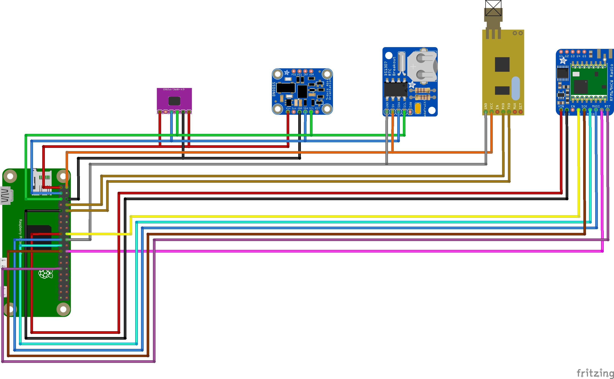

# CissTM Satellite V2 (Python)
[](https://travis-ci.com/CISSTM/SatelliteV2)


The CISSTM Satellite (Version 2), this is our satellite created using Python (and possibly a bit of C).
Our satellite is capable of getting the distance of an object using the RSSI and the light speed.

## How to install
### Clone from Github
Download the project
```
git clone https://github.com/CISSTM/SatelliteV2.git
```
### Open downloaded folder
```
cd SatelliteV2
```
### Install requirements
Firstly, install pip3 (the Python package manager).
```
sudo apt upgrade
sudo apt install python3-pip
```
Then install the requirements.
```
pip3 install -r requirements.txt
```
If there's a permission error, then you could use:
```
sudo pip3 install -r requirements.txt
```
### Run
Run the satellite software by using:
```
python3 src/main.py
```

## How to build
We've build our satellite using these components:
- Raspberry Pi Zero WH
- APC220 (should work with any serial 433 sender)
- BMP280
- BNO055
- DS1307 (for getting accurate time, not used with python, but connected to raspbian directly)
- RF69HCW (for localizing efforts)

### Wiring
